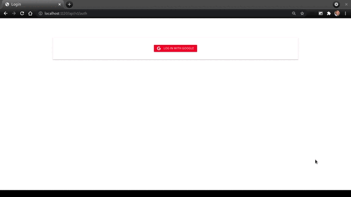

<h1 align="center">
  
  Social Auth Service API
</h1>

<p align="center">
  &nbsp;&nbsp;
   
</p>

The <b>social-auth-service-api</b> is an service example for authentication with <b>social media accounts</b> using the OAuth 2.0 API and [Passport](http://passportjs.org/) strategy with package [passport-google-oauth20](https://www.npmjs.com/package/passport-google-oauth20).


#### Accounts include:
* Google 


---
## Running locally

Clone the repository:

```sh
https://github.com/evertonpavan/social-auth-service-api
```

Rename env-example file to .env, and change data.

Build docker image:
```sh
docker build -t social-auth-service-api .
```

Start your container using the docker run:
```sh 
docker container run -d --name social-auth-service-api -p 1120:1120 social-auth-service-api
```
---


### Author

[Everton Pavan](https://github.com/evertonpavan)


